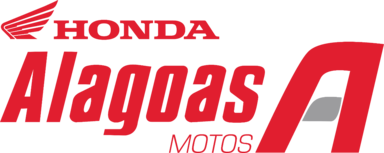

  

  <h1>Painel Operacional · Alagoas Motos</h1>

  

    Plataforma interna para gestão de <strong>leads</strong>, indicadores <strong>TSI</strong>,
    pesquisas de satisfação, rotinas da <strong>oficina</strong> e agendamentos da recepção.
  

  

    
    
    
    
    
    
  

Sobre o projeto

O Painel Operacional Alagoas Motos reúne informações que antes ficavam espalhadas entre planilhas, o MicroWork Cloud DMS e processos manuais. A aplicação oferece experiências específicas para consultores, oficina, administração e recepção, mantendo o MicroWork como fonte operacional quando necessário.

O layout foi desenvolvido para funcionar em desktop, tablets, smartphones e TVs, com temas claro e escuro, componentes reutilizáveis, feedbacks de carregamento e indicadores de status acessíveis.

# Principais módulos
Área, Recursos, Painel do consultor, Resumo de resultados, metas, lembretes e leads recentes, Leads, Cadastro, edição, filtros, deduplicação, conversão, relatórios e importação de planilhas

## TSI · Top2Box
Metas, evolução por período, ranking de lojas, matriz de desempenho e monitoramento de pesquisas, Pesquisas, Listagem detalhada, filtros, importação e reenvio de pesquisas por e-mail ou WhatsApp, Clientes fiéis, Cadastro e identificação automática por nome ou telefone

## Oficina
Dashboard de O.S., indicadores financeiros, consulta de revisões, prazos de garantia e cálculo de TMO

## Agendamentos
Sincronização do MicroWork, agenda diária e modo TV para a recepção

## Administração
Gestão de revisões, serviços, mão de obra, mercadorias e valores

## Chat interno
Comunicação entre consultor e oficina com atualização em tempo real, Fluxo dos agendamentos

# Licença

Projeto de uso interno da Alagoas Motos. Nenhuma licença de código aberto foi definida neste repositório.

  Desenvolvido para tornar o acompanhamento operacional da Alagoas Motos mais simples, visual e conectado.

