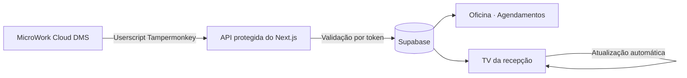

<div align="center">
  

  <h1>Painel Operacional · Alagoas Motos</h1>

  <p>
    Plataforma interna para gestão de <strong>leads</strong>, indicadores <strong>TSI</strong>,
    pesquisas de satisfação, rotinas da <strong>oficina</strong> e agendamentos da recepção.
  </p>

  <p>
    
    
    
    
    
    
  </p>
</div>

---

## Sobre o projeto

O **Painel Operacional Alagoas Motos** reúne informações que antes ficavam espalhadas entre planilhas, o MicroWork Cloud DMS e processos manuais. A aplicação oferece experiências específicas para consultores, oficina, administração e recepção, mantendo o MicroWork como fonte operacional quando necessário.

O layout foi desenvolvido para funcionar em desktop, tablets, smartphones e TVs, com temas claro e escuro, componentes reutilizáveis, feedbacks de carregamento e indicadores de status acessíveis.

## Principais módulos

| Área | Recursos |
| --- | --- |
| **Painel do consultor** | Resumo de resultados, metas, lembretes e leads recentes |
| **Leads** | Cadastro, edição, filtros, deduplicação, conversão, relatórios e importação de planilhas |
| **TSI · Top2Box** | Metas, evolução por período, ranking de lojas, matriz de desempenho e monitoramento de pesquisas |
| **Pesquisas** | Listagem detalhada, filtros, importação e reenvio de pesquisas por e-mail ou WhatsApp |
| **Clientes fiéis** | Cadastro e identificação automática por nome ou telefone |
| **Oficina** | Dashboard de O.S., indicadores financeiros, consulta de revisões, prazos de garantia e cálculo de TMO |
| **Agendamentos** | Sincronização do MicroWork, agenda diária e modo TV para a recepção |
| **Administração** | Gestão de revisões, serviços, mão de obra, mercadorias e valores |
| **Chat interno** | Comunicação entre consultor e oficina com atualização em tempo real |

## Fluxo dos agendamentos



- O userscript lê somente as linhas visíveis da listagem do MicroWork.
- A sincronização atualiza os registros sem duplicá-los.
- A API da TV mascara dados pessoais antes de enviá-los à tela da recepção.
- O painel destaca a próxima chegada e atualiza a agenda automaticamente.

## Tecnologias

- **Next.js 16** com App Router
- **React 19** e **TypeScript 5.7**
- **Tailwind CSS 4** e estrutura **shadcn/ui**
- **Supabase** para PostgreSQL, Realtime e persistência
- **Netlify** para hospedagem e funções server-side
- **XLSX** para leitura e exportação de planilhas
- **Framer Motion** e **GSAP** para interações e animações
- **Lucide React** para iconografia
- **Tampermonkey** para integração com o MicroWork Cloud DMS

## Como executar localmente

### Requisitos

- [Node.js 20 ou superior](https://nodejs.org/)
- Uma conta e um projeto no [Supabase](https://supabase.com/)

### Instalação

```bash
git clone https://github.com/almotosara/sitetsi.git
cd sitetsi/alagoas-motos
npm ci
cp .env.example .env.local
npm run dev
```

A aplicação ficará disponível em `http://localhost:8080`.

## Variáveis de ambiente

Preencha o arquivo `.env.local` usando `.env.example` como referência:

| Variável | Visibilidade | Finalidade |
| --- | --- | --- |
| `NEXT_PUBLIC_SUPABASE_URL` | Pública | URL do projeto Supabase |
| `NEXT_PUBLIC_SUPABASE_ANON_KEY` | Pública | Chave anônima usada pelo cliente |
| `SUPABASE_SERVICE_ROLE_KEY` | **Secreta · servidor** | Acesso administrativo usado pelas rotas protegidas |
| `AGENDAMENTOS_SYNC_TOKEN` | **Secreta · servidor** | Autoriza a sincronização enviada pelo userscript |
| `TV_ACCESS_TOKEN` | **Secreta · servidor** | Autoriza o navegador da TV da recepção |

> [!IMPORTANT]
> No Netlify, informe o nome da variável no campo **Key** e somente o valor no campo **Value**. Nunca use o prefixo `NEXT_PUBLIC_` em chaves secretas e publique um novo deploy após qualquer alteração.

## Preparação do Supabase

Execute os scripts necessários pelo **SQL Editor** do Supabase:

| Arquivo | Conteúdo |
| --- | --- |
| `supabase-setup.sql` | Leads, TSI, clientes fiéis, preferências e chat |
| `supabase-setup-os.sql` | Linhas e indicadores de Ordens de Serviço |
| `supabase-agendamentos.sql` | Agendamentos sincronizados do MicroWork |
| `supabase-revisoes.sql` | Modelos, revisões, mercadorias, serviços e mão de obra |
| `supabase-migration-servico-dms.sql` | Migração aditiva do código de serviço do DMS |

> [!WARNING]
> `supabase-revisoes.sql` recria as tabelas `rev_*`. Depois que houver valores editados em produção, use apenas as migrações aditivas indicadas para evitar perda de dados.

## Integração com o MicroWork

Os scripts do Tampermonkey ficam em `alagoas-motos/userscript`:

```text
userscript/
├── microwork-agendamentos-sync.user.js
└── microwork-autofill_final.user.js
```

- `microwork-agendamentos-sync.user.js`: captura a agenda visível e envia ao painel.
- `microwork-autofill_final.user.js`: auxilia o preenchimento de O.S. a partir dos dados gerados pelo sistema.

Para a sincronização, configure no userscript a URL `https://SEU-SITE/api/agendamentos/sync` e o mesmo valor usado em `AGENDAMENTOS_SYNC_TOKEN`. **Nunca coloque a `SUPABASE_SERVICE_ROLE_KEY` no Tampermonkey.**

## Modo TV

Na primeira abertura do navegador da recepção, acesse:

```text
https://SEU-SITE/tv/agendamentos/acesso?chave=SEU_TV_ACCESS_TOKEN
```

Após a validação, o navegador poderá abrir diretamente:

```text
https://SEU-SITE/tv/agendamentos
```

## Scripts disponíveis

| Comando | Ação |
| --- | --- |
| `npm run dev` | Inicia o ambiente de desenvolvimento na porta `8080` |
| `npm run build` | Gera o build otimizado de produção |
| `npm run start` | Inicia a aplicação compilada |
| `npm run lint` | Executa a análise estática do código |

## Estrutura resumida

```text
sitetsi/
├── README.md
└── alagoas-motos/
    ├── app/                 # Rotas, páginas e APIs do Next.js
    ├── components/          # Dashboard, telas e componentes de interface
    │   ├── admin/
    │   ├── oficina/
    │   ├── os/
    │   ├── ui/
    │   └── views/
    ├── lib/                 # Regras, integrações, cálculos e acesso a dados
    ├── public/              # Identidade visual, motos, fontes e documentos
    ├── userscript/          # Integrações Tampermonkey com o MicroWork
    ├── supabase-*.sql       # Estrutura e migrações do banco
    ├── .env.example
    ├── netlify.toml
    └── package.json
```

## Deploy no Netlify

1. Importe este repositório no Netlify.
2. Defina `alagoas-motos` como **Base directory**.
3. Cadastre todas as variáveis de ambiente.
4. Execute os scripts SQL necessários no Supabase.
5. Publique o projeto.

O arquivo `netlify.toml` já configura Node.js 20, `npm run build`, o diretório `.next` e o adaptador oficial do Next.js.

## Segurança antes de publicar

> [!CAUTION]
> Este sistema trabalha com dados internos e informações de clientes. Revise estes pontos antes de disponibilizá-lo publicamente.

- Nunca envie `.env.local`, service roles ou tokens ao GitHub.
- Marque `SUPABASE_SERVICE_ROLE_KEY`, `AGENDAMENTOS_SYNC_TOKEN` e `TV_ACCESS_TOKEN` como valores secretos na hospedagem.
- O projeto atualmente possui autenticação interna baseada em contas estáticas em `lib/auth.ts`. Antes de um uso público, migre as credenciais e o segredo de sessão para variáveis protegidas ou para um provedor de autenticação.
- Troque imediatamente qualquer senha ou token que já tenha aparecido no histórico de commits.
- Revise as políticas RLS do Supabase conforme o nível de acesso desejado.
- A TV deve receber somente os dados mascarados fornecidos pela API própria.

## Documentação complementar

- [Agendamentos e modo TV](./alagoas-motos/AGENDAMENTOS-TV-LEIA-ME.md)
- [Painel administrativo](./alagoas-motos/PAINEL-ADMIN-LEIA-ME.md)
- [Dashboard de Ordens de Serviço](./alagoas-motos/OS_DASHBOARD_README.md)
- [Configuração de ambiente](./alagoas-motos/.env.example)

## Licença

Projeto de uso interno da **Alagoas Motos**. Nenhuma licença de código aberto foi definida neste repositório.

---

<div align="center">
  Desenvolvido para tornar o acompanhamento operacional da Alagoas Motos mais simples, visual e conectado.
</div>
